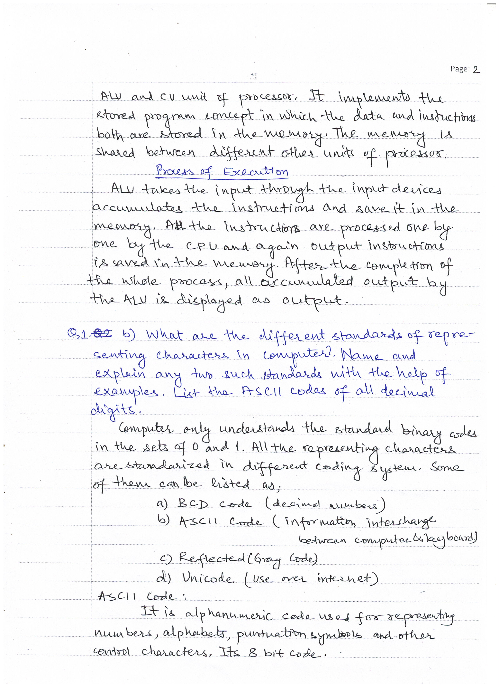
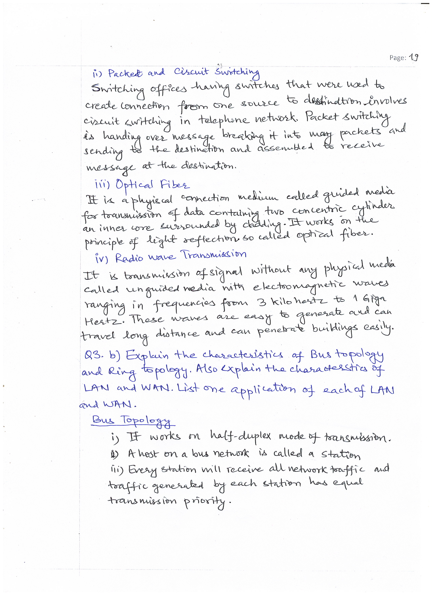

# BACHELOR OF COMPUTER APPLICATIONS(BCA)
## Assignment I
|  |  |  |
|-------------|-------------|---------|
|Course Code |:| BCS-011 |
|Course Title |:| Computer Basics and PC Software| 
|Assignment Number |:| BCA (1)/01/Assignment/2022-23|
|Maximum Marks |:| 100|
|Weightage |:| 30%|
|Last Dates for Submission |:| 31st October, 2022|

### <u> **Question Paper** </u> 
**This assignment has three questions of 80 marks. Answer all the questions. Rest 20 marks
are for viva voce. You may use illustrations and diagrams to enhance explanations. Please
go through the guidelines regarding assignments given in the Programme Guide for the
format of presentation. Please give precise answers. The word limit for each part is 200
words.**
#### **Q1. (Covers Block 1) (7×4=28)**
##### **a) What is VLSI? How did it change the design of a computer system? Explain the working of von Neumann Architecture with the help a diagram. Also explain the process of execution of an instruction for a von Neumann machine.**
##### **b) What are the different standards of representing character in a computer? Name and explain any two such standards with the help of examples. List the ASCII codes of all the decimal digits.**
##### **c) Convert the following numbers as directed**
###### **(i) Decimal 197.0625 into equivalent binary and hexadecimal.**
###### **(ii) Decimal 4567654 into binary and hexadecimal**
###### **(iii) String “Character Codes of alphabets and special character $ #” to ASCII and UNICODE strings.**
###### **(iv) Hexadecimal ABCDFFED to decimal and binary**
##### **d) What is the need of ROM in a computer? How is it different to RAM? Why is cache memory needed even if a computer has RAM and ROM? Why secondary memory is needed?**
##### **e) Explain the disk layout of Hard disk and CD-ROM? Also, explain the access time of magnetic disk and CD-ROM. Which of these has smaller access time?**
##### **f) Compare and contrast the following technologies:**
###### **(i) Parallel port and Serial port**
###### **(ii) Mouse and Light pen**
###### **(iii) Voice based input and Keyboard input**
###### **(iv) Inkjet printers and Laser printers**
##### **g) Explain the characteristics/functions of the following in the context of a computer system:**
###### **(i) Proxy Server**
###### **(ii) Motherboard**
###### **(iii) Scandisk utility**
###### **(iv) My Documents**
#### **Q2. (Covers Block 2) (7×4=28)**
##### **a) What are the key features of client/server architecture? What are the benefits of using client/server architecture? How is file sharing architecture different from client/server architecture?**
##### **b) Explain the characteristics of object-oriented programming? What are the advantages of using object-oriented programming?**
##### **c) List and explain the functions of the following in the context of software:**
###### **(i) Types of Software Licensing**
###### **(ii) Software as a service**
###### **(iii) Diagnostic programs**
###### **(iv) Perverse Software**
##### **d) Explain the following in the context of an Operating System:**
###### **(i) Graphical User Interface and Command line interface**
###### **(ii) Directory structure and its use in File Management**
###### **(iii) Input/Output Services**
###### **(iv)Process management in multitasking operating system**
###### **(v) Time Sharing system**
###### **(vi)Memory management in multi-programming operating system**
##### **e) Draw a flow chart and write an algorithm to find the sum of the digits of any two digit number given as input. (Hint: For the input number 68, the sum of digits would be 6+8=14. The key is to extract each digit.).**
##### **f) Explain the meaning and output of each line of the following program segment. How many times the loop at (ii) and (iii) will be executed?**
**&nbsp;&nbsp;&nbsp;&nbsp;(i) &nbsp;&nbsp;int n = 10;** 
**&nbsp;&nbsp;&nbsp;&nbsp;&nbsp;&nbsp;&nbsp;&nbsp;&nbsp;&nbsp;int i, x=1;**  
**&nbsp;&nbsp;&nbsp;&nbsp;(ii) &nbsp;for (i=1; i<=n; i=i+2)** 
**&nbsp;&nbsp;&nbsp;&nbsp;&nbsp;&nbsp;&nbsp;&nbsp;&nbsp;&nbsp;{** 
**&nbsp;&nbsp;&nbsp;&nbsp;(iii) x = x * i;** 
**&nbsp;&nbsp;&nbsp;&nbsp;&nbsp;&nbsp;&nbsp;&nbsp;&nbsp;&nbsp;}** 
**&nbsp;&nbsp;&nbsp;&nbsp;(iv) printf ("The final value is %d ", x);** 
g) Identify the software or type of software that will be required for the following situations.
Also, explain the steps that would be performed to solve the situation in question, if
applicable.
(i) A software development company maintains the list of tasks, expected time of
completion of the tasks on which staff, people are working. Which software
would help the company in planning and scheduling the projects.
(ii) You are planning to apply for a job in at least 10 companies. You are required to
create a letter for the human resource management of each company. Identify
which software and what features of that software would be used by you. Explain
these features.
(iii) You want to judge the performance of each employee by finding the number of
hours he/she has worked in last month. The employee attendance data (with in
and out time) is available to you. This data is to be analyzed and suitable graphs
are to be created to highlight individual work hours. Identify the suitable software
and the features of the software that would be needed to create graphs.
(iv) You are required to create a meeting information system for an organization. This
system should setup meetings for different groups of employees informing them
about meeting date, meeting agenda, notes etc. What kind of software will you
use for such work?

#### <u> **Answer Sheets** </u>
|Page 1|
|:-----------------------------------------:|
| |

|Page 2|
|:--------------------------------------------------:|
| |

|Page 3|
|:--------------------------------------------------:|
| |

|Page 4|
|:--------------------------------------------------:|
| |

|Page 5|
|:--------------------------------------------------:|
| |

|Page 6|
|:--------------------------------------------------:|
| |

|Page 7|
|:--------------------------------------------------:|
| |

|Page 8|
|:--------------------------------------------------:|
| |

|Page 9|
|:--------------------------------------------------:|
| |

|Page 10|
|:--------------------------------------------------:|
| |

|Page 11|
|:--------------------------------------------------:|
| |

|Page 12|
|:--------------------------------------------------:|
| |

|Page 13|
|:--------------------------------------------------:|
| |

|Page 14|
|:--------------------------------------------------:|
| |

|Page 15|
|:--------------------------------------------------:|
| |

|Page 16|
|:--------------------------------------------------:|
| |

|Page 17|
|:--------------------------------------------------:|
| |

|Page 18|
|:--------------------------------------------------:|
| |

|Page 19|
|:--------------------------------------------------:|
| |

|Page 20|
|:--------------------------------------------------:|
| |

|Page 21|
|:--------------------------------------------------:|
| |