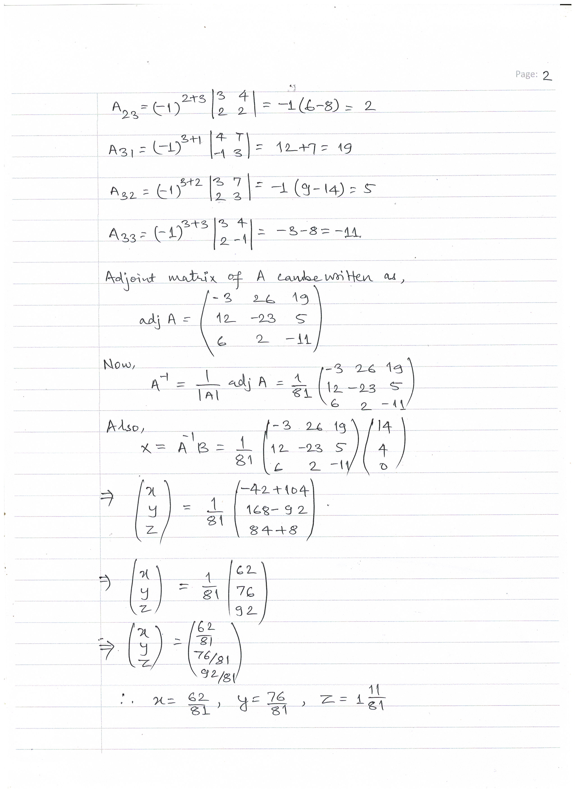

# BACHELOR OF COMPUTER APPLICATIONS(BCA)
## Assignment I
|  |  |  |
|-------------|-------------|---------|
|Course Code |:| BCS-011 |
|Course Title |:| Basic Mathematics| 
|Assignment Number |:| BCA(1)012/Assignment/2022-23|
|Maximum Marks |:| 100|
|Weightage |:| 25%|
|Last Dates for Submission |:| 31st October, 2022|
### <u> **Question Paper** </u>
**Note: This assignment has 15 questions of 80 marks (Q.no.1 to 14 are of 5 marks each, Q15 carries 10 marks). Answer all the questions. Rest 20 marks are for viva voce. You may use illustrations and diagrams to enhance explanations. Please go through the guidelines regarding assignments given in the Programme Guide for the format of presentation.**

#### Q1. Solve the following system of equations by using Matrix Inverse Method.
    1. 3x+ 4y+ 7z= 14
    2. 2x-y+ 3z= 4
    3. 2x + 2y - 3z = 0
#### Q2. Use principle of Mathematical Induction to prove that:
$\frac{1}{1*2}+\frac{1}{2*3}+.........+\frac{1}{n*(n+1)}=\frac{n}{(n+1)}$
#### Q3. How many terms of G.P  $\sqrt{3}, 3 , 3\sqrt{3}, .......$ Add up to 39
#### Q4. If $y = a.e^{mx} + b.e^{-mx}$, Prove that $d^2y/dx^2 = m^2y$
#### Q5. For what value of 'k' the points (-k + 1, 2k), (k, 2 - 2k) and ( - 4 - k, 6 - 2k) are collinear.
#### Q6. Evaluate $\int \frac{xdx}{(x+1)(2x−1)}$ and $\int \frac{dx}{(e^x-1)^2}$
#### Q7. If $1, w, w^2$ are cube roots of unity show that $(1+ w)^2 - (1 + w)^3 + w^2 = 0$.
#### Q8. If $α, β$ are roots of equation $2x^2-3x-5=0$ form a Quadratic equation whose roots are $α^2, β^2$
#### Q9. Solve the in equality $\frac{3}{5}(x − 2) ≤ \frac{5}{3}(2 − x)$ and graph the solution set.
#### Q10. A spherical ballon is being Inflated at the rate of $900 cm^3/sec$. How fast is the radius of the ballon increasing when the radius is 15 cm.
#### Q11. Find the area bounded by the curves $x^2 = y$ and $y = x$.
#### Q12. Determine the values of x for which $f(x) = x^4 – 8x^3 + 22x^2– 24x + 21$ is increasing and for which it is decreasing.
#### Q13. Using integration, find length of the curve y = 3 – x from (-1, 4) to (3, 0).
#### Q14. Show that the lines $\frac{x − 5}{4} = \frac{y-7}{-4} = \frac{z-3}{-5}$ and $\frac{x − 8}{4} = \frac{y-4}{-4} = \frac{z-5}{4}$ Intersect.
#### Q15. A manufacturer makes two types of furniture, chairs and tables. Both the products are processed on three machines A1, A2 and A3. Machine A1 requires 3 hours for a chair and 3 hours for a table, machine A2 requires 5 hours for a chair and 2 hours for a table and machine A3 requires 2 hours for a chair and 6 hours for a table. The maximum time available on machines A1, A2 and A3 is 36 hours, 50 hours and 60 hours respectively. Profits are $20 per chair and $30 per table. Formulate the above as a linear programming problem to maximize the profit and solve it.

#### <u> **Answer Sheets** </u> <a href="images/Assignment-BCS-012.pdf"> Open Pdf </a>
|Page 1|
|:-----------------------------------------:|
| |

|Page 2|
|:--------------------------------------------------:|
| |

|Page 3|
|:--------------------------------------------------:|
| |

|Page 4|
|:--------------------------------------------------:|
| |

|Page 5|
|:--------------------------------------------------:|
| |

|Page 6|
|:--------------------------------------------------:|
| |

|Page 7|
|:--------------------------------------------------:|
| |

|Page 8|
|:--------------------------------------------------:|
| |

|Page 9|
|:--------------------------------------------------:|
| |

|Page 10|
|:--------------------------------------------------:|
| |

|Page 11|
|:--------------------------------------------------:|
| |

|Page 12|
|:--------------------------------------------------:|
| |

|Page 13|
|:--------------------------------------------------:|
| |

|Page 14|
|:--------------------------------------------------:|
| |

|Page 15|
|:--------------------------------------------------:|
| |

|Page 16|
|:--------------------------------------------------:|
| |

|Page 17|
|:--------------------------------------------------:|
| |

|Page 18|
|:--------------------------------------------------:|
| |

|Page 19|
|:--------------------------------------------------:|
| |

|Page 20|
|:--------------------------------------------------:|
| |

|Page 21|
|:--------------------------------------------------:|
| |

|Page 22|
|:--------------------------------------------------:|
| |