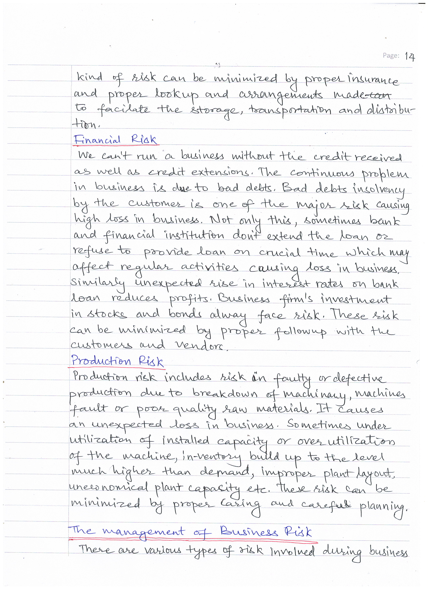

# BACHELOR OF COMPUTER APPLICATIONS(BCA)
## Assignment I
|  |  |  |
|-------------|-------------|---------|
|Course Code |:| ECO-01 |
|Course Title |:| Business Organization| 
|Assignment Number |:| BCA (1)/01/Assignment/2022-23|
|Maximum Marks |:| 100|
|Weightage |:| 30%|
|Last Dates for Submission |:| 31st October, 2022|

### <u> **Question Paper** </u> 
**There are five questions in this assignment which carried 100 marks.Answer all the questions. Please go through the guidelines regarding Assignments given in the Program Guide for the format of presentation.Attempt all the questions:**
#### Q1. What are the essential features of business? List different objectives of business. (10+10)
#### Q2. What is capital structure? Describe factors that determine the capital structure. (2+18)
#### Q3. Discuss various arguments in support of and against advertising. (20)
#### Q4. Discuss the pervasiveness of risk in business. Describe briefly the management of business risks. (10+10)
#### Q5. Comment briefly on the following statements: (4 x 5)
 ##### a) An entrepreneur is a good judge of which products will sell.   
 ##### b) Stock exchange plays a very important role in the economic development of a country.  
 ##### c) There are various reasons of the government participating in business.  
 ##### d) The government company form of organization suffers from certain limitations.  

### <u> **Answer Sheets** </u>
|Page 1|
|:-----------------------------------------:|
| |

|Page 2|
|:--------------------------------------------------:|
| |

|Page 3|
|:--------------------------------------------------:|
| |

|Page 4|
|:--------------------------------------------------:|
| |

|Page 5|
|:--------------------------------------------------:|
| |

|Page 6|
|:--------------------------------------------------:|
| |

|Page 7|
|:--------------------------------------------------:|
| |

|Page 8|
|:--------------------------------------------------:|
| |

|Page 9|
|:--------------------------------------------------:|
| |

|Page 10|
|:--------------------------------------------------:|
| |

|Page 11|
|:--------------------------------------------------:|
| |

|Page 12|
|:--------------------------------------------------:|
| |

|Page 13|
|:--------------------------------------------------:|
| |

|Page 14|
|:--------------------------------------------------:|
| |

|Page 15|
|:--------------------------------------------------:|
| |

|Page 16|
|:--------------------------------------------------:|
| |

|Page 17|
|:--------------------------------------------------:|
| |

|Page 18|
|:--------------------------------------------------:|
| |

|Page 19|
|:--------------------------------------------------:|
| |

|Page 20|
|:--------------------------------------------------:|
| |

|Page 21|
|:--------------------------------------------------:|
| |