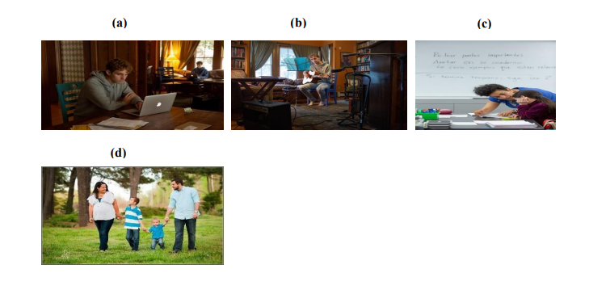
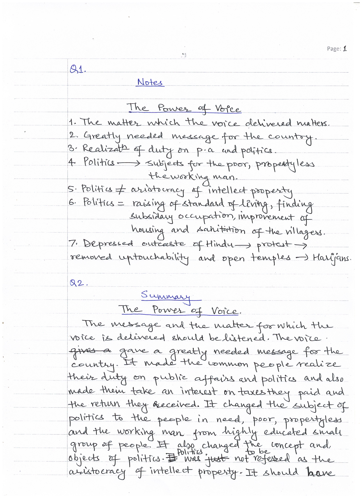
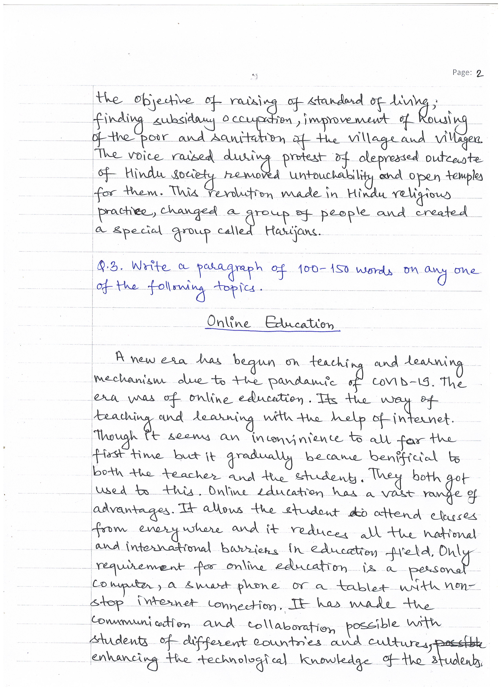
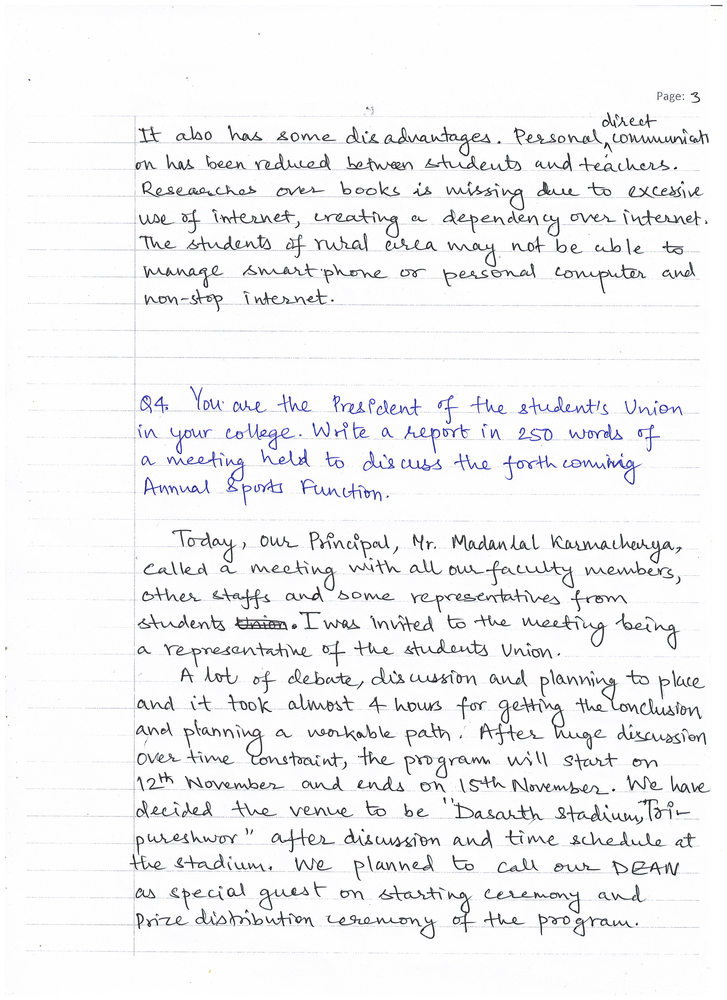
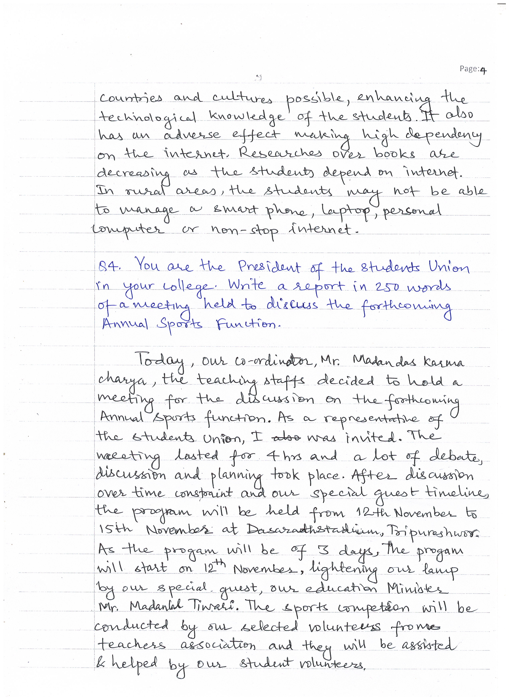
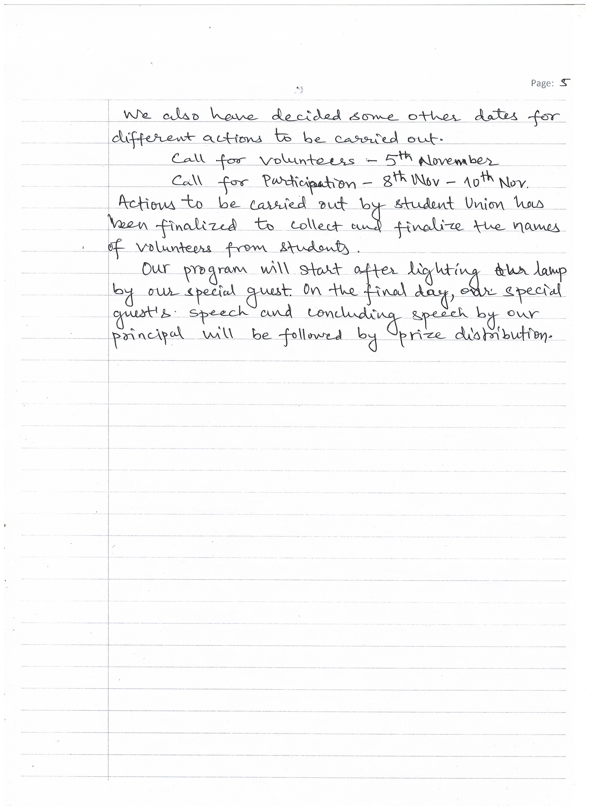
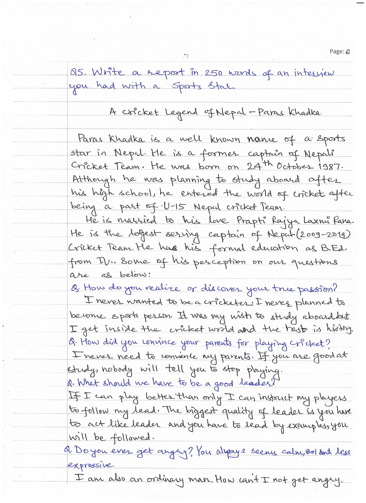
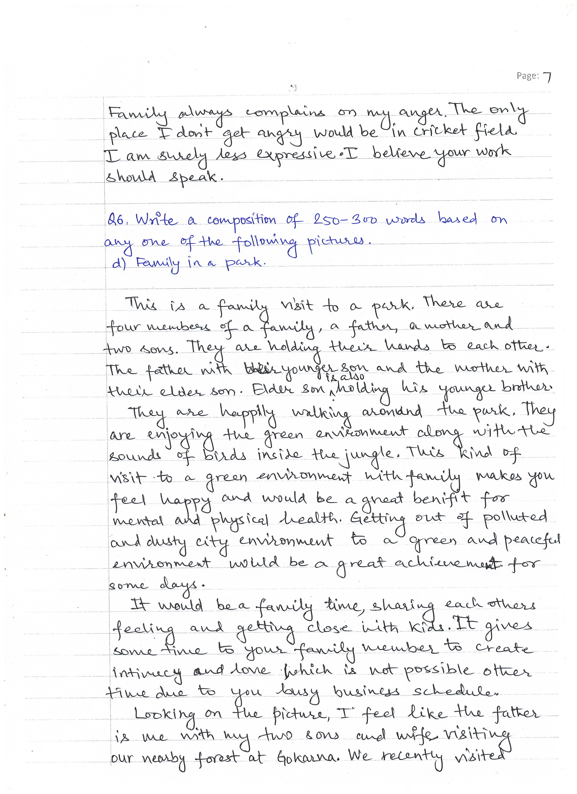
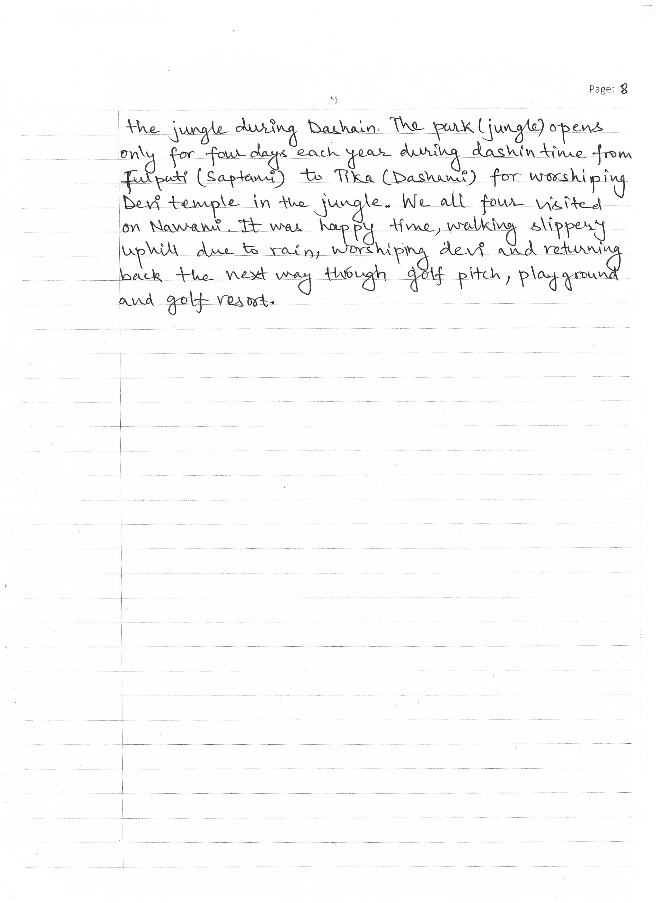

# BACHELOR OF COMPUTER APPLICATIONS(BCA)
## Assignment I
|  |  |  |
|-------------|-------------|---------|
|Course Code |:| FEG-02 |
|Course Title |:| English | 
|Assignment Number |:| BCA(1)-02/Assignment/22-23|
|Maximum Marks |:| 100|
|Weightage |:| 25%|
|Last Dates for Submission |:| 31st October, 2022|

### <u> **Question Paper** </u> 
**There are six questions in this assignment which carried 100 marks. Answer all the questions. Please go through the guidelines regarding assignments given in the Program Guide for the format of presentation.**
**Attempt all the questions**

#### Q1. Read the following passage and make notes in an appropriate format: (15)
The Voice had to be listened to, not only on account of its form but for the matter which it delivered. It gave a message to the country that it needed greatly. It brought to the common people a realization of their duty to concern themselves with their affairs. The common, people were made to take an interest in the manner in which they were governed in the taxes they paid in the return they got from those taxes. This interest in public affairs - politics as you may call it - was to be the concern no longer of the highly educated few but of the many - the poor, the propertyless, the workingmen in town and country. Politics was not to be the concern of a small aristocracy of intellect property of the masses. And with the change in the subjects of politics that Voice bought about also a change in the objects of polities. Till then politics had busied
itself mainly with the machinery of Government towards making its personnel more and more native, with proposals for a better distribution of political power, with protests against the sins of omission and of commission of the administration. This Voice switched politics on to concern for the needs of the common people. The improvement of the lot of the poor was to be the main concern of politics and the politician. The improvement, especially of the lives of the people of the neglected villages, was to be Placed before Governments and political organizations as the goal of all political endeavour. The raising of the standard of living of the people of the villages, the finding of subsidiary occupations which would give the agricultural
poor work for their enforced leisure during the off season and an addition to (heir exiguous income, the improvement of the housing of the poor, the sanitation, of the villages – these were to be the objectives to be kept in view. In the towns, the slums and cherries were to receive especial attention. There was especially a class of the poor for which that compassionate Voice pleaded and protested. This was for the so-called depressed class, the outcastes of Hindu society. The denial of elementary human rights to this class of people it considered the greatest blot on Hindu society and history. It raised itself in passionate protest against the age- old wrongs of this class and forced those that listened to it to endeavour to remove the most outrageous of them like untouchability. It caused a revolution in Hindu religious practice by having Hindu temples thrown open to these people. It made the care of them a religious duty of the Hindus by re-naming them  Harijans.
    -Mr. Ruthnasami
#### Q2. Write a summary of the passage and give it an appropriate title. (15)
#### Q3. Write a paragraph of 100-150 words on any one of the following topics: (10)
    a) Digital world-a boon or a bane?  b) Online Education
#### Q4. You are the President of the Students Union in your college. Write a report in 250 words of a meeting held to discuss the forthcoming Annual Sports Function. (20)
#### Q5. Write a report in 250 words of an interview you had with a Sports Star. (20)
#### Q6. Write a composition of 250-300 words based on any one of the pictures given below: (20)

### <u> **Answer Sheets** </u>
|Page 1|
|:-----------------------------------------:|
| |

|Page 2|
|:--------------------------------------------------:|
| |

|Page 3|
|:--------------------------------------------------:|
| |

|Page 4|
|:--------------------------------------------------:|
| |

|Page 5|
|:--------------------------------------------------:|
| |

|Page 6|
|:--------------------------------------------------:|
| |

|Page 7|
|:--------------------------------------------------:|
| |

|Page 8|
|:--------------------------------------------------:|
| |